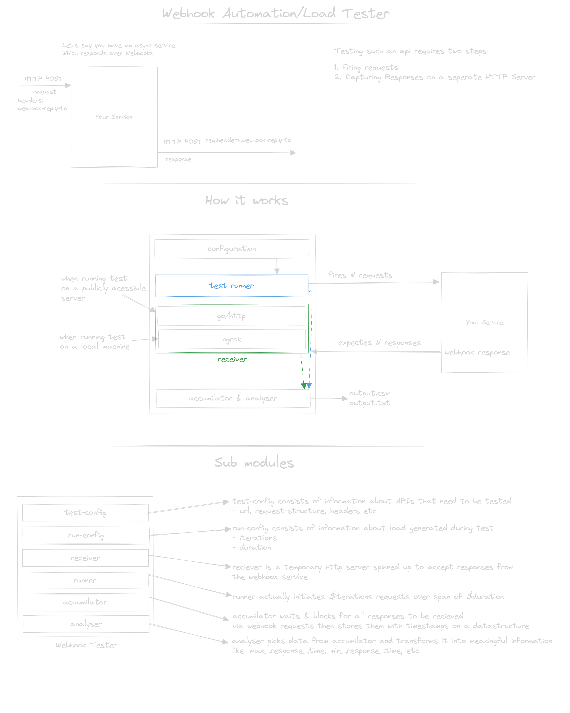

# webhook-load-tester


## What is this?

This tool helps developers test and load test asynchronous APIs that use webhooks. It's especially useful when you're working with APIs where the response comes later through a webhook, rather than immediately.

## Installation 

### CLI Tool

Install the command-line interface tool:

```bash
go install github.com/sarkarshuvojit/webhook-load-tester@latest
```

## Usage 

### Create config

Create a empty config file as starting point

```bash
$ webhook-load-tester create -c 001-test.yaml

```

### Run test from config

Run tests for that config file by passing with a `-c` flag

```bash
$ webhook-load-tester test -c 001-test.yaml
```

## Demos

#### Capturing Webhook Responses from a Local Service

[](https://asciinema.org/a/677409)

#### Capture Webhook Responses Locally from External Services via Ngrok

[](https://asciinema.org/a/677410)

## Why use it?

Testing webhook-based APIs can be tricky because:
1. The API call and the webhook response happen at different times.
2. It's hard to measure the total time from the initial call to the webhook response.
3. Load testing these APIs is challenging with traditional tools.

## How does it work?

1. **Mock Server**: Acts as a stand-in for your actual server, receiving and displaying incoming webhook requests.

2. **Configuration-based Testing**: Uses YAML files to define tests and load scenarios, making it easy to set up and modify test cases.

3. **End-to-End Timing**: Measures the complete flow from the initial API call to the webhook response, giving you a clear picture of your API's performance.

4. **Load Testing**: Allows you to simulate multiple users or high traffic scenarios to see how your API performs under stress.

## Key Features

- Easy-to-use YAML configuration for test scenarios
- Use Ngrok to load test webhooks from your local machine
- Built-in mock server to capture webhook responses
- Comprehensive timing measurements for the entire API flow
- Support for load testing asynchronous APIs
- Clear, visual representation of test results

## Who is it for?

- Developers working with webhook-based APIs
- QA engineers testing asynchronous systems
- DevOps professionals managing API performance

## Design



## Configuration 

It uses configuration files to run tests, where tests & load can be defined using a declarative yaml format.

Following is an example test config which can be used against the dummy webhook api.

```yaml
version: v1

server: ngrok # optional param

test:
  name: test-api-1
  
  # details about api which needs to be tested
  url: http://localhost:8080/
  body: "{\"message\": \"ok\"}"
  headers:
    client-id: gg
    client-secret: wp
  
  # injectors are used to update user defined requests with test-related variables
  injectors:

    # injects the reply-path to a specific path in the requests
    # when running locally it will use Ngrok url
    # when running on a public server it will use localhost or userDefinedHost
    replyPathInjector:
      path: "headers.webhook-reply-to"
    
    # injects the correlationId/traceId to the request
    correlationIdInjector:
      path: "body.uniqueId"

  # pickers are used to figure out where to pick specific info from the response
  pickers:
    # defines where to expect the correlationId/traceId when the downstream gives a callback
    correlationPicker:
      path: "body.uniqueId"

# actual run configuration 
# defines how many requests need to be fired over the span of how many seconds
# in the following example we can expect a request to be fired every 200ms (10s/50r)
run:
  iterations: 50
  durationSeconds: 10

# defines where and in which format the analysis output should go to
# analysis comprises of max, min, avg, etc
outputs:
  - type: text
    path: out.txt

# Uncomment the following line to use ngrok for exposing local server
# NGROK_AUTHTOKEN is required in the environment variables when using this mode
# server: ngrok
```

## Setting up locally

### Start Dummy Webhook API 

Start a simple webhook api

```bash
$ cd examples/dummy
$ go run main.go
```

### Start tests  

Start the actual tester

#### Using Go

```bash
$ go run cmd/runtest/main.go -f examples/dummy/input-example.yml 
$ go run cmd/runtest/main.go -v -f examples/dummy/input-example.yml # for verbose output
```

## TODO

- Safe shutdown
